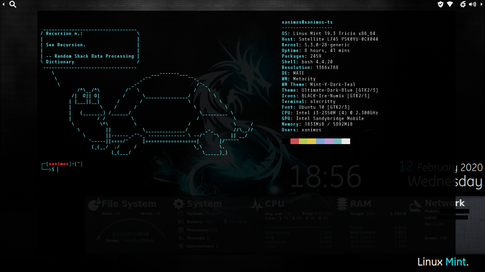
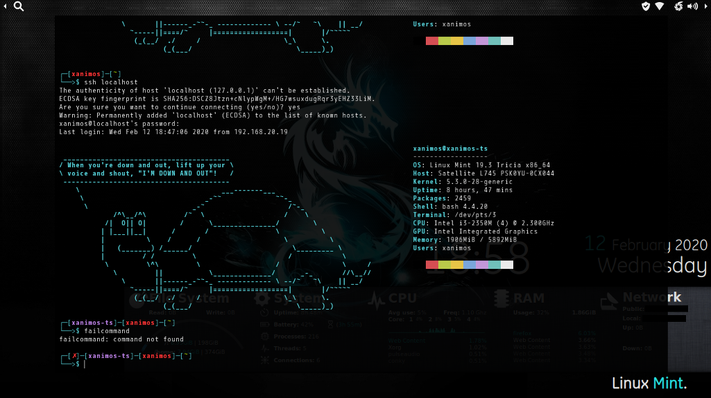
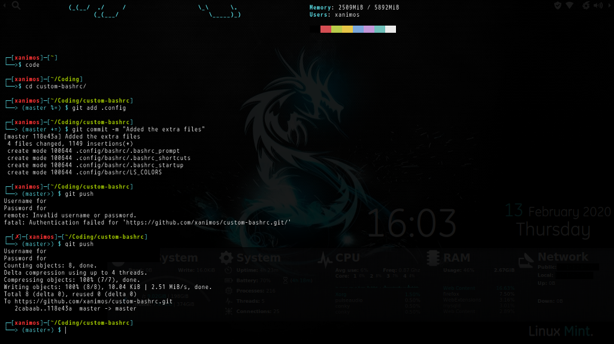
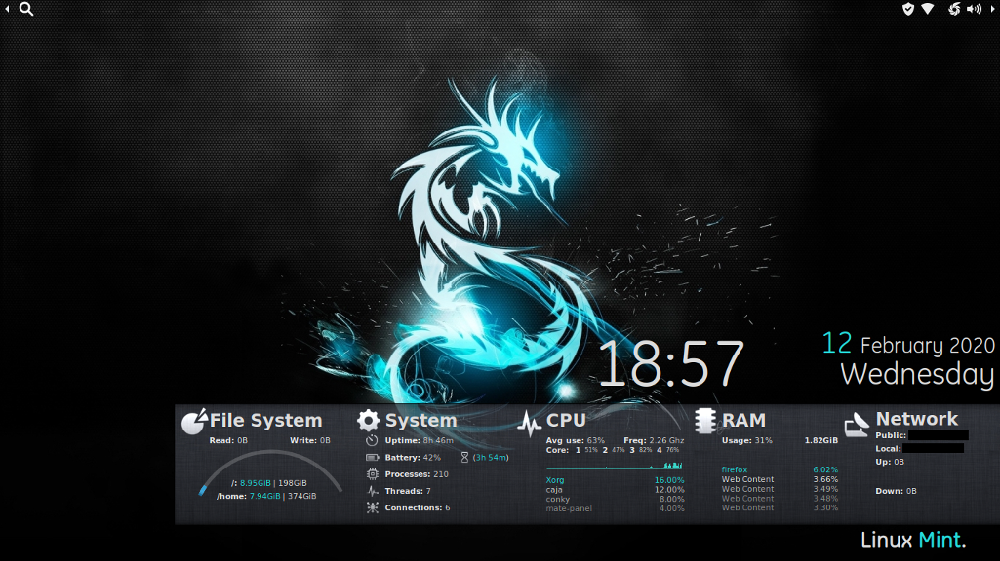

# Xanimos' custom .bashrc setup
Just wanted to share my custom bash setup. I'll include my alacritty.yml for fun as well. Hope someone likes it.
I built this using a few guides on different sites/repositories with credit given. 
I've found this all to be super useful/fun and hope someone else will also.
I'm putting this up here for all to use and build upon. Free and open!

### Table of contents
* [Installation](#installation)
* [Files Included](#files-included)
  * [.bashrc](#bashrc)
  * [.bashrc_startup](#bashrc_startup)
  * [LS_COLORS](#ls_colors)
  * [.bashrc_prompt](#bashrc_prompt)
  * [.bashrc_shortcuts](#bashrc_shortcuts)
* [How it Looks](#how-it-looks)
* [Credits](#credits)

## Installation
This all goes into your home folder in the structure on here. File structure should look like the following:
```sh
~
|-- .bashrc
|-- .config
|   `-- bashrc
|       |-- .bashrc_prompt
|       |-- .bashrc_shortcuts
|       |-- .bashrc_startup
|       `-- LS_COLORS
`-- README.md

# If you want to use the alacritty.yml it goes here
~
|-- .config
|   `-- alacritty
|       `-- alacritty.yml
```

## Files Included

#### .bashrc
The main file that the bash shell looks for. Should be saved to your home folder.
```shell
~/
# OR
/home/<username>
```
This file is basically the default one installed by Linux Mint 19.3, but with a few modifications.

The only important parts to change are:
* Adding this at the end:
```shell
# Include custom bashrc files.
for i in ~/.config/bashrc/.bashrc_* ; do
     if [ -r "$i" ]; then
          . $i
     fi
done
```
* Commenting out this prompt portion, if you use the .bashrc_prompt file:
```shell
### Set in ~/.config/bashrc/.bashrc_prompt
#if [ "$color_prompt" = yes ]; then
#    PS1='${debian_chroot:+($debian_chroot)}\[\033[01;32m\]\u@\h\[\033[00m\]:\[\033[01;34m\]\w\[\033[00m\]\$ '
#else
#    PS1='${debian_chroot:+($debian_chroot)}\u@\h:\w\$ '
#fi
```

#### .bashrc_startup
Displays the splash/welcome (turtle[cowsay]/neofetch) info and sets up LS_COLORS

For the splash screen to work you need to install cowsay, fortune, and neofetch.
```shell
apt install fortune
apt install fortunes
apt install cowsay
apt install neofetch
```
Note: if any of these are not installed it won't show, but will not error. It just skips over that part.

For LS_COLORS to setup, the LS_COLORS file needs to be in place.

#### LS_COLORS
The LS_COLORS file I use, pulled from github, link in credits

#### .bashrc_prompt
The customization of the prompt that's so nice. Read it over, it's heavily commented

#### .bashrc_shortcuts
A whole lot of useful aliases and functions. Read them over comment out what you don't want or learn them ;)

## How it Looks
Here are a few screen shots _(font and color shades are terminal dependant)_:

#### Welcome/Splash Screen

_Turtle love!_

#### SSH/Failed Command


#### Git Implementation/Fullscreen terminal

_<3 Alacritty_

#### Just the Desktop/Conky

_Let me know if anyone wants my conky config_


## Credits
I used quite a few different sources to build my custom bashrc setup. I've modified quite a bit from where I pulled from. Feel free to fork, use, and do what you like with this. Give credit to sources and myself.

#### Bashrc Pieces
* [aashutoshrathi/awesome-bashrc](https://github.com/aashutoshrathi/awesome-bashrc)

* [darkerego/awesome-bash](https://github.com/darkerego/awesome-bash)

* [brunops/bashrc_file](https://gist.github.com/brunops/4108756)

* [zachbrowne/The Ultimate Bad Ass .bashrc File](https://gist.github.com/zachbrowne/8bc414c9f30192067831fafebd14255c)

* [Git Prompt Variables](https://blog.backslasher.net/git-prompt-variables.html)

#### LS_COLORS

* [trapd00r/LS_COLORS](https://github.com/trapd00r/LS_COLORS)

#### Font
* [M+ 1M](https://www.fontsquirrel.com/fonts/m-1m)

#### Wallpaper
* [Dragon](https://www.pling.com/s/Artwork/p/1359055)
